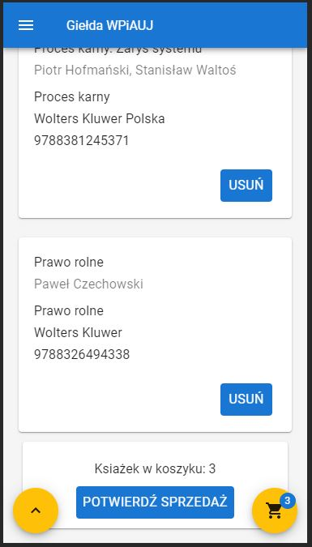
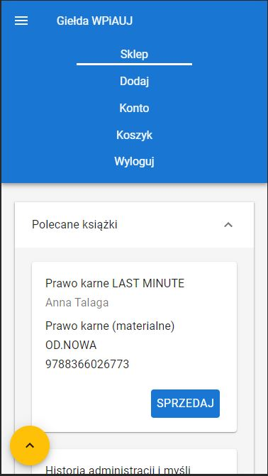

# Book Exchange
WPiA UJ Book Exchange official website.
Designed with mobile first principles in mind. Utilizes REST API to communicate with backend.

## Presentation

- Login


- Shop


- Basket



- Navigation




## Stack

- React
- Redux
- Redux Saga
- React Router
- Emotion
- Webpack
- Cypress
- Material UI

## Folder structure

```
src
├── components (reusable components)
├── constants (constant values)
├── routes (routing with associated pages and components)
├── modules (redux store)
│   ├── chat
│   ├── customRouter
│   ├── game
│   ├── gameHistory
│   ├── queue
│   ├── toaster
│   └── user
│
├── styles (style variables)
└──  utils (utility functions)
```

## Requirements

Install node package manager [npm](https://www.npmjs.com/).
You should be able to run the following commands.

```bash
node --version
npm --version
```

## Installation

```bash
git clone https://github.com/Nalhin/emoji
cd BookExchange
npm install
```

##  Start

```bash
npm run start
```
